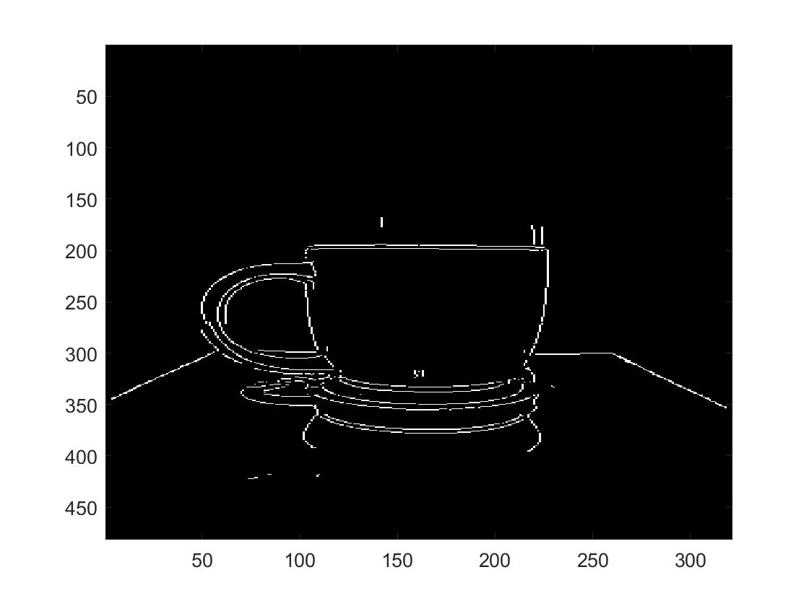
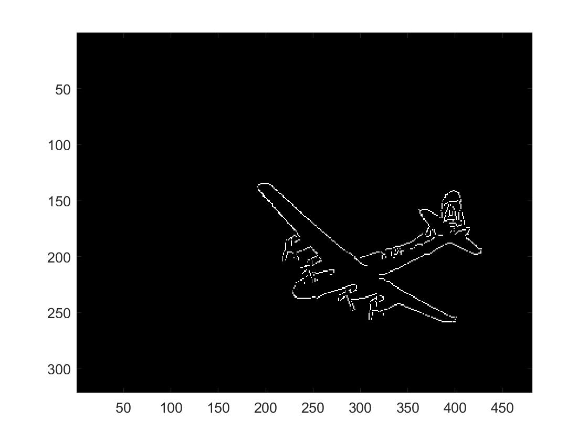

# Canny Edge Detection

- This project focuses on understanding image convolution and edge detection. The final goal of this project
  is to compute the Canny Edges for any RGB image.
  
- To generate edges for an image, run `Test_script.m`. `Test_script.m` is set to run with "3096.jpg" by default. To do the canny edge       detection with image "123.jpg", change "I" in Test_script to the following:
  
    - `I = imread('train_images_P1/123.jpg')`
    - Ofcourse you can also generate edge maps for any images of your choosing

- An example is shown below for two images.

, 

, 

