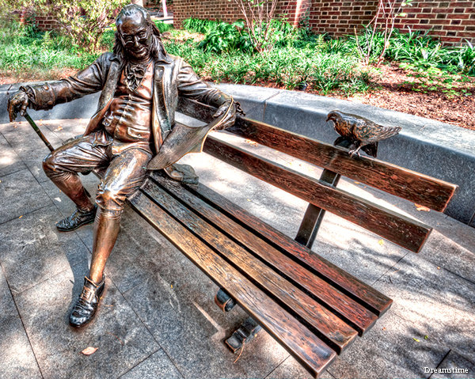

# Image Gradient Blending

- The goal of this project is to seamlessly blend an object from a source image into a target image. The blending is done as described in the paper "Poisson Image Editing" by Patrick Perez, Michel Gangnet and Andrew Blake.

- To generate two blended images, download the .m files and images into one folder, open MATLAB and run the following in the command         window:
    - resultImg = seamlessCloningPoisson('1_source.jpg','1_background.jpg', imread('1_mask.png'), 300, 250)
    - The function seamlessCloningPoisson.m takes in 5 inputs. The first is the source image (what you want to blend into another image),       second is the background image, third is the mask, and finally the fourth and fifth are the X and Y pixel locations of where the           blending will happen.

- In this particular example, I used a picture of "Ben on the Bench" as the background. The source image is a minnion. I also generated a mask image but this can be regenerated using the maskImage.m function if desired.

Source Image:

Mask Image:

Background Image:

- The resulting blended image is displayed below.

Resulting Blended Image:

