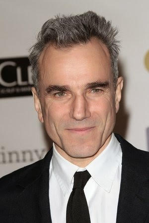
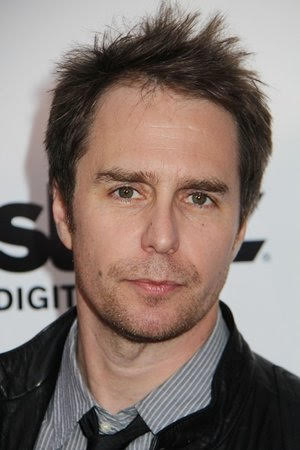

# Image Morphing

- The goal of this project is to morph an image of one person's face into another person's face. 

- A morph is a simultaneous warp of the image shape and a cross-dissolve of the image colors.The warp is controlled by
  defining a correspondence between the two pictures. The correspondence should map eyes to eyes, mouth
  to mouth, chin to chin, ears to ears, etc., to get the smoothest transformations possible.

- To run this code, simply run `Morph_Images.m` in MATLAB. I have preloaded the code with the correspondence points I made but you can       also define your own using `click_correspondences.m`.

- An example is shown below where I morphed an image of Daniel Day-Lewis into an image of Sam Rockwell.

Daniel Day-Lewis:

  
Sam Rockwell:

Image Morphing:

  
  
